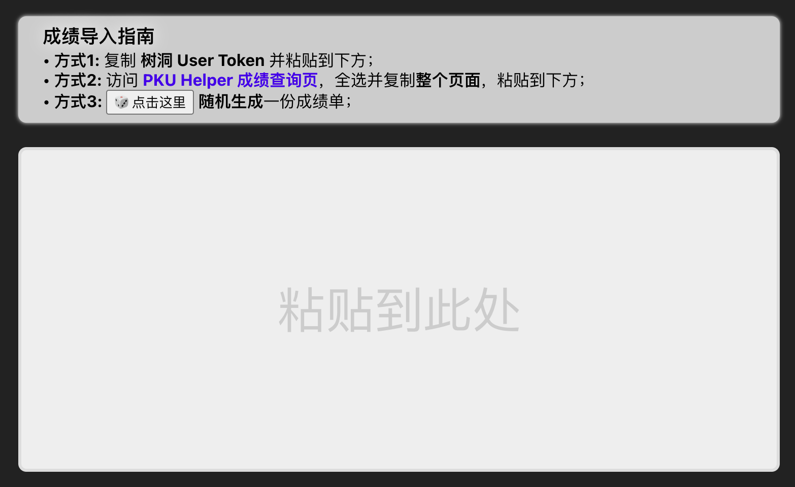
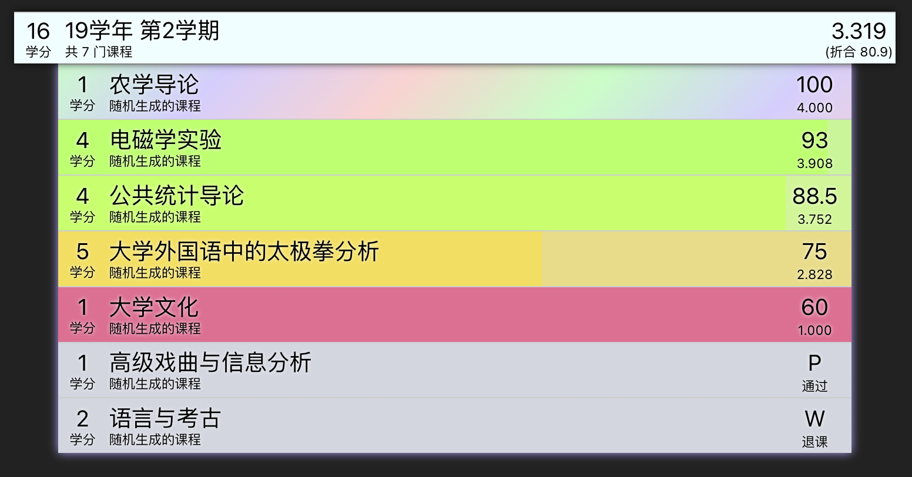
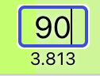
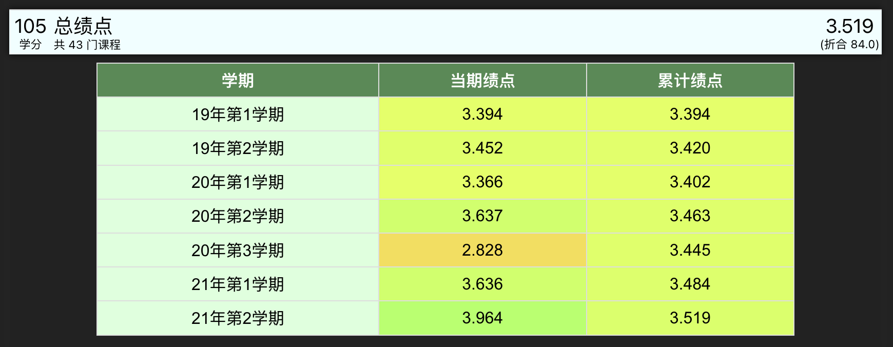
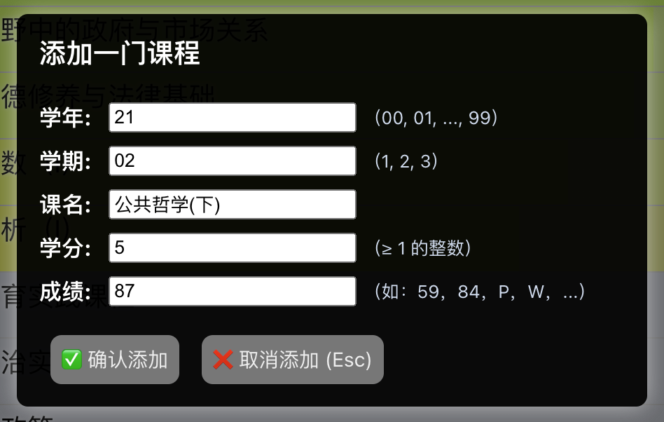
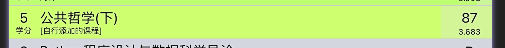
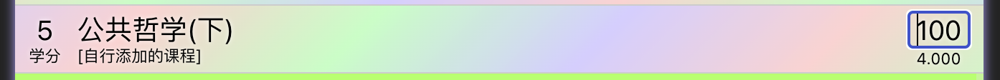
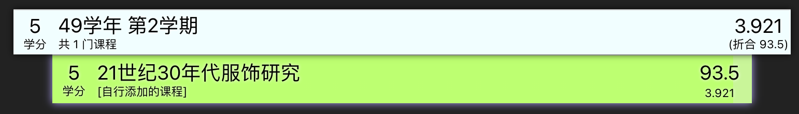

# GPA Simulator (绩点模拟器, GS)

PKU Helper 成绩查询复刻增强版.

- **复刻**了 PKU Helper [*成绩查询*](https://pkuhelper.pku.edu.cn/my_score/) 的基本功能, 并**增强**其成绩模拟的能力, 包括新增课程、往期绩点回溯等功能.
- **源代码**: https://github.com/PkuCuipy/gpa-simulator
- **构建版本**: https://pkucuipy.github.io/gpa-simulator-build 


<br>


# 用户手册
## 成绩导入

当第一次访问页面时, 需要选择一种方式导入成绩单.

- 在方式一中, `GS` 会使用 User Token 构建 URL 并直接从学校服务器获取成绩数据.
- 在方式二中, `GS` 会解析用户粘贴的网页的 `DOM` 结构, 从中解析出每门课程的数据.
- 在方式三中, `GS` 会**随机生成**一份成绩单, 其中的课程名、成绩等均是随机生成的. 



> 若仅作功能体验, 请以 ｢**方式三**｣ 继续.

## 成绩渲染

`GS` 的成绩单复刻了 PKU Helper 的设计风格.
课程会按照学期进行分块, 并按照成绩高低进行排序, 并由高至低依次用**绿色到红色**进行显示, 并对满分成绩以**流动彩虹色**标识.



另外, 它将每门课的百分制成绩折合为 `[1.0, 4.0]` 的绩点表示, 
并为每个学期计算平均绩点, 再折合为百分制表示. 

## 成绩修改

点击百分制成绩时, 即可进入成绩编辑状态. 
可以修改为任何合法的成绩, 比如 `[0, 100]` 的实数, 或者 `W`(表示退课)、`P`(表示通过)、`IX`(表示免修) 等等.



## 总结区

这一部分呈现了用户成绩单的总体统计信息. 除了将成绩单中的 ｢当期绩点｣ 汇总在一起之外, 还回溯推演了 ｢累计绩点｣.



## 添加课程

在成绩页面顶栏有三个按键, 这里介绍中间按钮的功能. (这三个功能也可通过快捷键 `F1~F3` 触发).


点击 `添加课程` 后, 会弹出窗口:



点击 `取消添加` 或按下 `Esc` 键或者点击旁边的空白处均可以关闭这个弹窗;
而点击 `确认添加` 后, 这门课程则会出现在成绩单中:



新增的课程也可以继续修改成绩:



也可以为目前尚不存在的学期添加一门课程, 这样会自动创建相应的新学期:



## 删除课程

`GS` 目前**没有** *显式的* `删除课程` 的功能. 
可以通过将相应课程成绩修改为 `W` (退课), 在 *逻辑上* 删除这门课.

---

# 实现相关

源码结构如下, 文件主要功能如右侧标注:

```Sh
./src
├── App.js			# 1. 主要界面的构建 (React JSX)
├── css					
│   ├── App.css			# 2. 主要组件的 CSS
│   └── index.css
├── icons/				
├── index.js			
└── utils
    ├── color.js		# 3. 成绩单 ｢染色逻辑｣
    ├── from-api.js		# 4. 基于 ｢User Token｣ 的 ｢成绩导入｣
    ├── from-paste.js		# 5. 基于 ｢粘贴 DOM｣ 的 ｢成绩导入｣
    ├── miscs.js		# 6. 绩点计算、成绩转换等
    └── random-generate.js	# 7. ｢随机生成成绩单｣ 的模块
```

## 主要界面

`App.js` 文件中以  `JSX` 语法构建了整个 `GS` 的用户界面, 包括交互设计、事件处理等.
整个 `GS` 被抽象为一个 `App` 组件, `App` 组件又由以下 6 个组件组成:

```jsx
<TitleBar/>
<AddCourseModal/>
<Importer/>
<GradeBook/>
<Summary/>
<BottomBar/>
```

- `TitleBar` 和 `BottomBar` 对应于页面的顶部和底部标题和说明;
- `Importer` 对应于初始页面中 3 种导入成绩的方式的 UI 和交互逻辑; (当导入成功后, 这一模块将被隐藏)
- `GradeBook` 对应于渲染每个学期的成绩单的 UI, 以及相应用户修改成绩的交互的逻辑;
- `Summary` 对应于底部总结区的表格的 UI;
- `AddCourseModal` 对应于添加课程时的弹出窗口.

## 弹出窗口的实现

｢全屏显示在顶层｣ 使用到的属性主要包括:

```css
.modal {
    position: fixed;
    z-index: 2;
    left: 0;
    top: 0;
    width: 100%;
    height: 100%;
}
```

｢隐藏弹出窗口｣ 使用了 `display: none` 的 Trick, 而非从 DOM 中移除这一元素.

## 成绩单染色

使用了 HSL 色彩空间实现渐变和过渡.
定义了 100 分的 HSL 颜色和 60 分的 HSL 颜色后, 其余的分数只需要对 `H` 分量 (Hue) 进行线性插值.

为了实现 100 分的 ｢彩虹色效果｣, 分为两个部分: 配色 + 动画: (**这一部分复制自 @PKU Helper 源码**)

```css
.rainbow-moving {
    background: linear-gradient(-45deg,
        #c5fcc5,#ffd1d1,#d1d1ff,#c5fcc5,#ffd1d1,
        #d1d1ff,#c5fcc5,#ffd1d1,#d1d1ff,#c5fcc5,
        #ffd1d1,#d1d1ff,#c5fcc5) 0 0;			/* 通过 linear-gradient 定义了彩色条带 */
    background-size: 1800px 200px !important;
    animation: rainbow-moving 5s linear infinite;	/* 配合 @keyframes 实现彩虹移动效果 */
}
@keyframes rainbow-moving {
    0% {background-position-x: 0;}
    100% {background-position-x: -1000px;}
}
```

## 基于 User Token 的成绩导入

- PKU Helper 从学校官方获取成绩单的 API 为:`https://pkuhelper.pku.edu.cn/api_xmcp/isop/scores?user_token=${token}`, 这里 `user_token` 是 PKU Helper 的通用验证 token, 可以从 [树洞](https://pkuhelper.pku.edu.cn/hole/) 中复制.
- 这个 API 是 `Access-Control-Allow-Origin: *` 的, 允许跨域, 因此可以直接使用 `XMLHttpRequest` 异步获取数据后再在回调函数中解析 JSON 即可.
- 见函数 `fetchCourseInfoAll()`.

## 基于 DOM 的成绩导入

- `Importer` 本质上是一个 `contenteditable` 的 `div`.
- 当用户全选官方成绩单页面并粘贴后, 这个 `div` 里会得到一棵完整的 `DOM` 树, 这正是 PKU Helper 成绩查询页面的 DOM.
  那么通过 `DOM` 的各种 `API` 就可以解析这棵 DOM 树, 最终得到每门课程的成绩数据.
- 解析的过程比较繁琐, 思路就是先在 Developer Tools 中观察并记下每个数据的 CSS Selector, 然后编写 JS 自动提取. 
- 见函数 `parseCourseInfoAll()`.

## 数据结构

导入的成绩信息组织成 ｢课程信息｣ 的 Array, 其中 ｢课程信息｣ 是一个 Object, 具有如下字段:

```js
{
    credit: "学分数",
    name: "课程名称",
    score: "课程成绩",
    original_score: "未修改的课程成绩",
    semester: "[学期年份, 学期编号]",
    unique_id: "全局唯一标识码",
}
```

## 生成课程信息

- 学分和成绩的生成方法就是对 `Math.random()` 的简单封装 (分别对应 `randint` 和 `random_choice` 函数).
- **课程名的生成**并未用到高深的 ML/NLP 方法, 而是基于人工规则进行的:
  - 首先准备一些**前缀名** `prefixes`, 包括 `大学`、`公共`、`普通` 等等;
  - 然后准备一些**学科名** `concepts`, 包括 `数学`、`物理学`、`哲学` 等等;
  - 然后定义**关联词** `connectives` 和**后缀名** `suffixes`;
  - 最后基于生成模式: `prefix concept (connective concept)? suffix` 进行生成.
- 如此, 可以随机生成 ｢乍一看还算合理｣ 的课程名.
- 见函数 `random_course_name()`.
